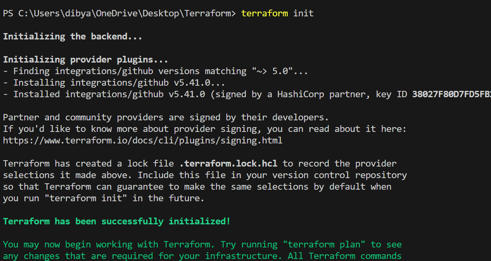
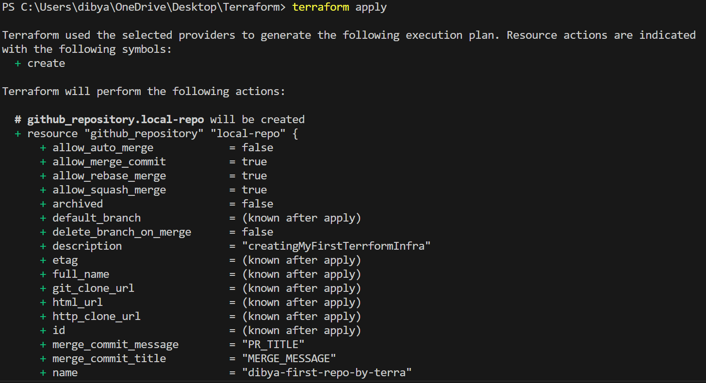
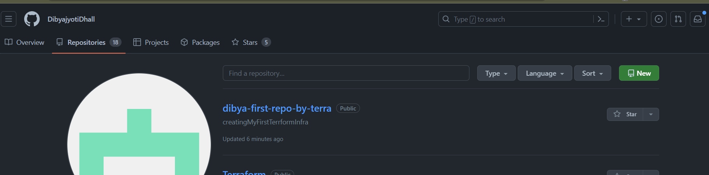

# Creating a GitHub Repository using Terraform

This guide will walk you through the process of creating a GitHub repository using Terraform. We'll create a Terraform configuration that creates a new public GitHub repository.

## Step 1: Create a Terraform Configuration File

First, create a `.tf` file (e.g., `main.tf`) with the following Terraform configuration:

```hcl
terraform {
  required_providers {
    github = {
      source  = "integrations/github"
      version = "~> 5.0"
    }
  }
}

provider "github" {
  token = "YOUR_GITHUB_TOKEN"
}

resource "github_repository" "local-repo" {
  name        = "dibya-first-repo-by-terra"
  description = "creatingMyFirstTerraformInfra"
  visibility  = "public"
}

Replace `"YOUR_GITHUB_TOKEN"` with your actual GitHub token, which you can create in your GitHub account settings.
```
## Step 2: Initialize Terraform and Download Provider Plugins

Open your terminal and run the following command to initialize your Terraform configuration and download the required provider plugins:

```shell
terraform init
```

This will create a `.terraform` directory in your project folder and download the necessary provider plugins.

### Terraform Init


## Step 3: Apply the Configuration

Now, apply your Terraform configuration to create the GitHub repository. Use the following command:
```shell
terraform apply -auto-approve
```

--> The `-auto-approve` flag is used to automatically approve and apply the changes without prompting for confirmation.

### Terraform Apply


## Step 4: Verify the Repository

Terraform will execute the plan, and upon successful execution, your GitHub repository will be created. You can log into your GitHub account to verify the new repository.

**Congratulations!** You've successfully created a GitHub repository using Terraform.
### Terraform Apply

